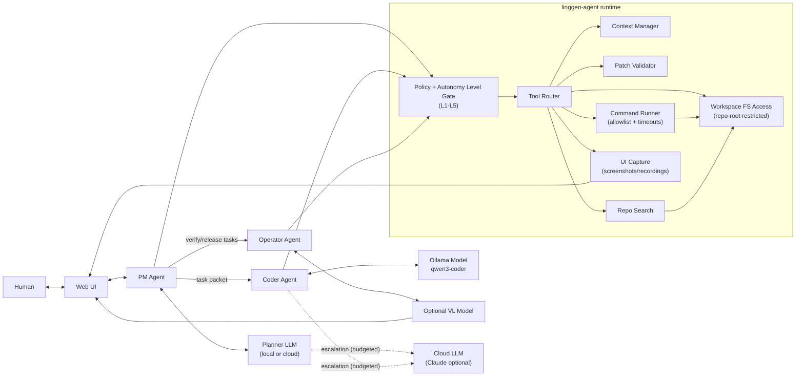

# linggen-agent Framework

This is the **technical design** for `linggen-agent` (Rust): runtime architecture, tool protocol, and
safety enforcement.

For product intent (goals, UX, autonomy definitions L1-L5, UI workflow), see `doc/product-spec.md`.

## Scope

V1 focus:

- A patch-first Coder agent (CLI) backed by local Ollama (e.g. `qwen3-coder`).
- A strict tool router + patch validation + allowlisted `/check` execution.

vNext expands the runtime to orchestrate multiple agents (PM/Coder/Operator) and serve a Web UI,
but those goals and UX flows are defined in the product spec.

## Architecture Overview (Mermaid)

## Session Principles (technical)

- Default capability is **safe**: read/list/search and run allowlisted verification commands.
- Default change mechanism in v1 is **patch-first** (unified diffs), with mandatory patch validation.
- For long-running automation (L2+), the runtime may apply changes automatically, but MUST keep:
  - policy-gated tools
  - audit trail (tool calls, commands, diffs/changes)
  - checkpoints + rollback (git-based)
  - loop detection (iteration/time budgets + repeated failure detection)

## Workspace Resolution

### Repo Root

V1 root detection:

- Walk upward from the current working directory to find `.git/`.
- If found, that directory is the repo root.
- If not found, use the current working directory as the workspace root.

### Web UI + multi-job workspace selection (vNext)

For Web UI and long-running jobs, the server MUST NOT accept arbitrary filesystem paths from the
browser. Workspace selection is policy-driven via config:

- `linggen-agent.toml` defines **allowlisted workspace roots** (directories) and/or a **managed
  workspace store** (clones + worktrees).
- The UI requests a workspace by `workspace_id` (or a repo identifier) from that allowlist.
- The server resolves the real filesystem path and scopes all tools to that root.

Rationale:

- Prevents accidental/malicious access to unrelated sensitive paths (especially important once the
  server supports multiple users).
- Provides a stable foundation for quotas/ACLs later.

### Worktree-per-job (recommended for concurrency)

To run multiple coder jobs concurrently without file contention, use **worktree-per-job**:

- Each job runs in its own `git worktree` directory.
- The tool router is scoped to that worktree root.
- Rollback uses `git reset --hard <checkpoint>` to a checkpoint commit within the job branch.

Typical flow:

1. Select base repo (allowlisted or managed clone).
2. `git worktree add <workdir> -b job/<job_id> <base_ref>`.
3. Run PM/Coder/Operator steps inside `<workdir>`.
4. Periodic checkpoint commits (deterministic rollback + progress).
5. Merge/PR back to base, then `git worktree remove`.

If `.git` is missing, worktree-per-job must be disabled or the runtime must initialize git explicitly.

### Ignore Rules

V1 respects `.gitignore`.

- File listing and search should filter paths using `.gitignore` rules.
- Prefer using a library that implements gitignore semantics rather than re-implementing.

## Agent Architecture (Rust)

Recommended crate layout:

- `linggen-agent-cli` (bin)
  - Argument parsing, TUI/REPL loop, streaming output
- `linggen-agent-core` (lib)
  - Engine, tool router, patch validation, conversation state
- `linggen-agent-ollama` (lib)
  - Ollama client (chat + streaming)

If keeping a single crate initially, keep the module boundaries as above so splitting is easy later.

### Core Components

1. Engine

- Owns session state: task, plan, gathered context, tool history, patches.
- Runs the main loop: clarify -> gather context -> propose plan -> generate patch -> optionally verify -> refine.
- For multi-agent, becomes an **Orchestrator** that routes tasks between PM/Coder/Operator agents.

2. Tool Router (Capability Layer)

- Exposes a small, strict set of tools to the model.
- Enforces safety and determinism:
  - path canonicalization and repo-root restriction
  - timeouts
  - command allowlist for `/check`
  - output truncation
- Enforces autonomy policy: tool availability and approvals depend on Autonomy Level.

3. Context Manager

- Maintains a context budget.
- Selects:
  - small repo map summary
  - a few relevant file chunks
  - search results snippets
- Avoids dumping entire files unless requested.
- Should prefer retrieval/summarization over “stuffing” massive context windows by default.

4. Patch Validator

- Accepts only unified diffs.
- Validations:
  - paths are relative to repo root
  - no absolute paths
  - no `..` segments
  - reasonable size limits (require explicit confirmation if exceeded)
- When autonomy allows applying patches, the validator remains mandatory as a safety gate.

5. Ollama Client

- Chat completion with streaming.
- Tool calling via a strict JSON schema (even if model is not native tool-calling):
  - the runtime parses assistant output
  - if invalid, the runtime requests a retry with an error message

6. Cloud Model Client (optional)

- Used only when configured and policy permits (Autonomy Level + budget gates).
- Primary use cases: planning, difficult refactors, deep reviews, or repeated failure recovery.
- Must be cost-controlled by strict prompt packaging and per-task budgets.

## Tool Protocol (Model-Facing)

The model should only interact through tools with structured arguments.

Minimum tool set for v1:

- `get_repo_info()` -> { root, platform, git_detected }
- `list_files({ globs?, max_results })` -> { files[] }
- `read_file({ path, max_bytes, line_range? })` -> { content, truncated }
- `search_rg({ query, globs?, max_results })` -> { matches[] }
- `run_command({ cmd, cwd?, timeout_ms? })` -> { exit_code, stdout, stderr, truncated }
- `propose_patch({ diff })` -> { ok, errors[] }

Planned extensions (gated by Autonomy Level):

- `apply_patch({ diff })` -> { ok, errors[] }
- `create_branch({ name })` / `commit({ message })` (optional; not required for patch-first)
- `deploy({ target, artifact? })` -> { ok, report }
- `notify({ channel, message })` -> { ok }

Notes:

- `run_command` is only enabled for `/check` and should be constrained (see next section).
- `propose_patch` performs validation only; it never applies patches.

## /check (Verification) Design

### UX

- User types: `/check cargo test` (or similar)
- The agent runs the command and summarizes failures.

### Safety

- Default deny: only allow a small set of verification commands.
- Recommended initial allowlist patterns:
  - Rust: `cargo test`, `cargo fmt --check`, `cargo clippy`, `cargo check`
  - Node: `npm test`, `pnpm test`, `yarn test` (optional)
- Disallow commands that include shell metacharacters (`;`, `&&`, `|`, `>`, `<`, backticks) unless explicitly enabled.

## Multi-Agent + Web UI (product-level)

Roles, UX, and UI workflow are defined in `doc/product-spec.md`.

Technical requirements for the runtime:

- **Session event stream** (plans, tool calls, errors, stage transitions)
- **Artifact store** (diffs, logs, reports, screenshots/recordings)
- **UI capture hooks** (e.g. Playwright screenshots/recordings) routed via the tool router and gated by policy

## Multi-Agent Runtime (vNext technical)

### AgentManager + per-agent queues

Introduce a single **AgentManager** (start with 1 manager) that owns:

- **Queues** per agent type (PM/Coder/Operator) or a unified queue with a `target_agent` field.
- **Job lifecycle** state (queued/running/blocked/succeeded/failed/cancelled).
- An internal **message bus** for PM↔Coder coordination:
  - PM publishes plan/user-story updates
  - Coder publishes questions, progress, and artifacts

### ModelManager (shared capacity + routing)

Model selection is managed by a stateful **ModelManager**:

- Loads `[[models]]` from `linggen-agent.toml`.
- Enforces `max_inflight` (busy capacity) per model.
- Supports role suitability (PM/Coder/Operator) and fallback rules.
- Provides blocking `acquire(role, constraints)` to wait for an appropriate model when needed.

## Prompting Strategy (Patch-Only)

The system prompt for the coder agent must enforce:

- No direct file writes.
- Output changes only as a unified diff.
- Use tools to inspect before patching.
- If uncertain, ask a minimal clarifying question.

Recommended pattern:

1. Gather context with tools.
2. Present plan (short).
3. Produce patch.
4. Suggest `/check` commands.

## Future Extensions

- Daemon mode (`serve`) for editor integrations.
- Optional integration with Linggen project knowledge:
  - read `.linggen/` (memory/policy/skills) to apply repo-specific constraints.
- Multi-agent under `@linggen-agent`:
  - `coder` (first implementation)
  - `pm` (planner/dispatcher)
  - `operator` (test/build/release/deploy)
  - later: `reviewer`, `release`, `refactor`, `social`, and more.
